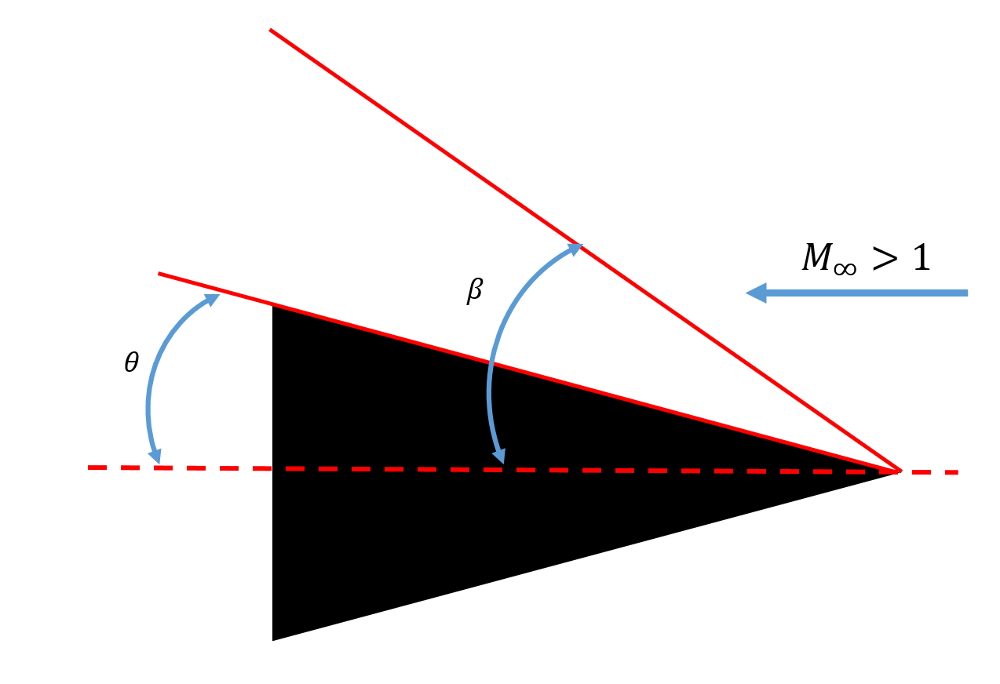
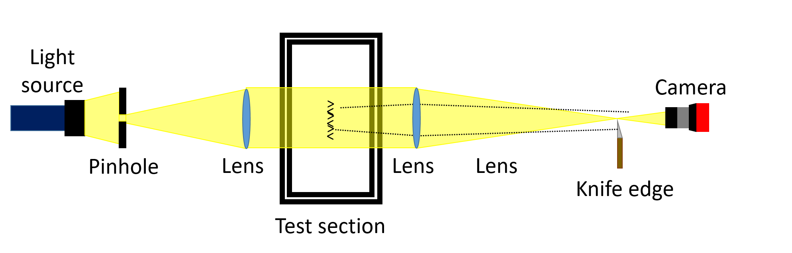
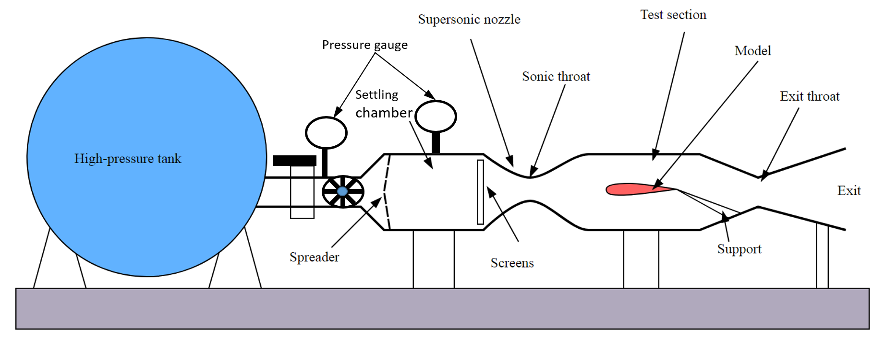
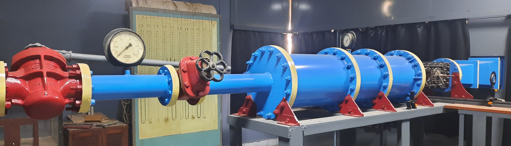
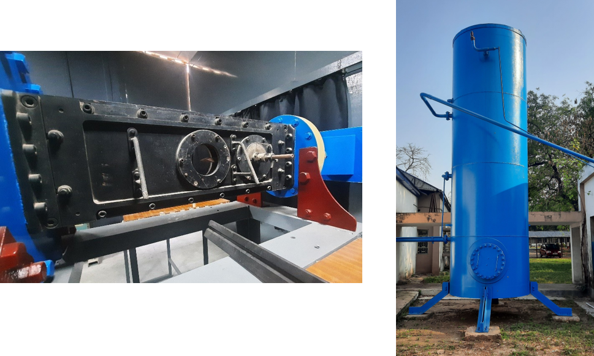
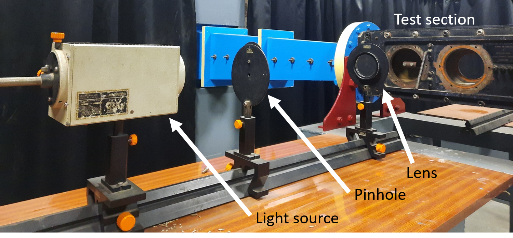
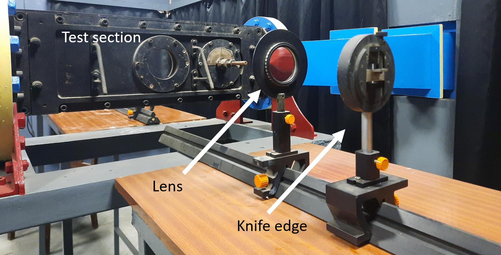
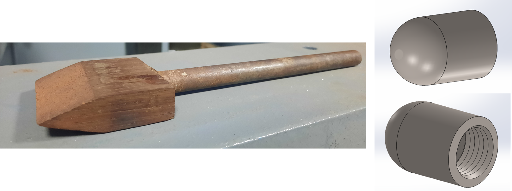

# Theory:

#### Figure 1 Supersonic flow around a sharp-edged wedge body

When a body (both streamlined or non-streamlined) moves in the air with speeds higher than the speed of sound, shock waves are produced due to the abrupt changes in the flow field. Figure 1 shows a sharp-edged wedge in supersonic flow at zero angle of attack. The deflection angle of the ramp is denoted by θ. Contrary to the normal shock wave, the shock wave that originates at the sharp edge is at an angle (𝛽) to the body axis and is called an oblique shock. The angle (𝛽) is called the shock angle. The shock wave imparts changes in gas properties by a large amount and is characterized by a sudden jump in pressure and density in a very small region. The Schlieren imaging system (see Schematic in Figure 2) measures variations in the density in the test region; therefore, it helps visualize the shockwaves.

## Principle of Schlieren:
The density changes in the air due to the presence of shock waves change the refractive index in the shock wave-affected regions of the air. A light ray transmitted through a fluid flow of variable refractive index is thus affected due to refraction. Therefore, the orthogonal ray is deflected from the original direction after encountering the region affected by the shock wave. The Schlieren imaging picks up these changes due to its sensitivity to the changes in the first density gradient.
 

#### Figure 2 Schematic of the Schlieren imaging setup

Figure 2 presents a schematic of a typical lens-based Schlieren imaging setup. The light source and pinhole setup project a beam on the lens, which collimates the light beam. This collimated beam is passed through the test section. After the test section, another lens focuses the beam on a sharp knife edge. The knife is placed to block the light, and the amount of light blocked by the knife edge is called a ‘cut-off’. A camera is positioned in front of the knife edge to capture images. Any changes in the density field inside the test section will change the refractive index of the medium and deflect the light rays. The region of origin for light rays that deflect towards the knife edge will appear dark compared to the unaffected regions in the images captured. Similarly, the region of origin of light rays that deflect away from the knife edge will appear brighter than the unaffected region.

In the present experiment, we use the Schlieren imaging method to visualize flow around different bodies with shapes frequently used in supersonic aircraft design. Specifically, we use a wedge like a ramp, with two different deflection angles and a blunt hemispherical-head axisymmetric body. 

The supersonic flow impinging on a sharp-edge wedge produces an oblique shock. At smaller deflection angles (θ), the shock is attached. With increasing deflection angle, the shock angle increases until the threshold value of θmax. However, for θ > θmax, the deflection angle exceeds the maximum possible flow deviation angle for the attached shock, and therefore, the oblique shock detaches from the sharp edge of the wedge and becomes a detached oblique shock. Contrary to the sharp-edge wedge, which is like a streamlined body, the flow deviation angle is already high in the hemispherical head blunt body. Therefore, the shock produced by the impinging supersonic flow is already detached. The shock wave in this case is also curved compared to the relatively straight shock wave in the wedge case. The bluff nature of the body is overall responsible for this behaviour.

## Apparatus

•	Supersonic wind tunnel
•	Schlieren imaging system (Light source, lenses, knife edge, color filter, camera)
•	Models: wedges with different deflect angles, blunt body with and without spike

### Supersonic wind tunnel

#### Figure 3 Schematic of the supersonic wind tunnel.

 

#### Figure 4 Actual photograph of the supersonic wind tunnel.

The supersonic wind tunnel is used for the present experiment. A schematic and a photograph of the actual wind tunnel used in the present experiment are given in Figures 3 and 4. This tunnel's test section (see Figure 5 (left)) is 5 cm x 10 cm. The wind tunnel can produce supersonic flow with Mach number up to 2.3 in the test section. The test section has two viewing windows made with glass capable of sustaining the operational pressure differences during the experiment run.

This wind tunnel is a blow-down type of tunnel. One end of the tunnel is connected to the high-pressure tank, and the other is open to the atmosphere. A valve regulates the pressure in the settling chamber upstream of the C-D nozzle; the exit pressure is the atmosphere. Air is drawn from the high-pressure tank (see Figure 5 (right)), filled with pressurized air, and dried after compression. A long manifold with two pairs of pressure control valves and a pressure gauge connects the tank with the settling chamber of the tunnel.

#### Figure 5 Test section of the supersonic wind tunnel (left) and the high-pressure tank (right)

The air released into the settling chamber enters the test section through a nozzle. The flow reaches the sonic condition in the throat of this nozzle and then, in the divergent section, further accelerates to supersonic speeds. The test section is located downstream of this nozzle. Models are placed in this test section for different experiments. To further decelerate the flow after the test section, the flow is brought to the sonic condition in the second throat further downstream test section, post which the flow becomes subsonic in the diffuser.

### Schlieren imaging system (Light source, lenses, knife edge, color filter, camera)

The Schlieren imaging system can be divided into two different legs. 

#### Figure 6: Light projection system.

#### A) The light projection system:
This system (see Figure 6) consists of the light source, pinhole, and lens for collimating light in parallel beam. All these components lie before the light interacts with the test region. We have used a wattage filament bulb with a mirror-projection housing to project light on the pinhole dial with multiple size holes. A convex lens with a 400 mm focal length is kept further to collimate the beam.

#### Figure 7: Light acquisition system.

#### B) The acquisition system:
This system (see Figure 7) comprises the focusing lens, knife edge, and the imaging device. All these components are positioned after the interaction of the light with the test region. We have used a 500 mm focal length lens and a sharp knife edge. For capturing images we have used a DLSR camera.

### Models

#### Figure 8 Different models used in the present experiment: Wedge (left) and blunt body with aerospike (right).

Different models used in this experiment are:

1) wedge (ramp) with deflection angle θ = 14 degrees and 22.5 degrees
2) hemispherical blunt body with a base diameter of 17.6 mm
